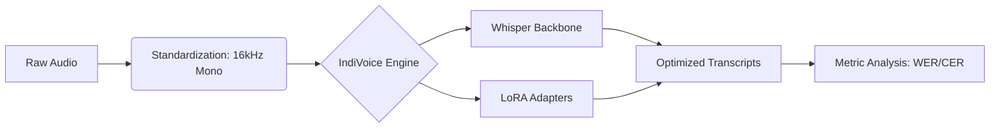

<div align="center">
  
  
  # 🎧 IndiVoice-DeepASR: Indian-Accented Speech Recognition
  
  **Bridging the Accent Gap in Modern ASR with Whisper + LoRA**
  
  [](https://github.com/purvanshjoshi/IndiVoice-DeepASR/stargazers)
  [](https://huggingface.co/datasets/ai4bharat/Svarah)
  [](https://pytorch.org/)
  [](LICENSE)

  [**Explore the Code**](https://github.com/purvanshjoshi/IndiVoice-DeepASR) • [**Launch Colab**](https://colab.research.google.com/github/purvanshjoshi/IndiVoice-DeepASR/blob/main/notebooks/IndiVoice_Colab_Entry.ipynb) • [**Launch Kaggle**](https://github.com/purvanshjoshi/IndiVoice-DeepASR/tree/main/kaggle)

  > [!IMPORTANT]
  > **Ultra-Resilience Update (v1.8)**: Added high-frequency checkpointing (every 100 steps) and auto-resumption to protect against Colab/Kaggle runtime disconnections. Resolved `load_best_model_at_end` compatibility issues.
</div>

---

## 🌟 Overview

Current commercial ASR systems suffer from a **20-30% performance drop** when processing Indian English accents. **IndiVoice-DeepASR** is a research-driven project that fine-tunes OpenAI's Whisper models using **LoRA (Low-Rank Adaptation)** to achieve state-of-the-art accuracy across diverse Indian linguistic profiles.

### ✨ Key Features
- **🛡️ Ultra-Resilient**: Automatic checkpoint detection and resumption. Never lose more than 10-15 minutes of training.
- **🚀 Efficiency**: Fine-tune with < 2% of total parameters using PEFT techniques.
- **🇮🇳 Localization**: Optimized for Hindi, Tamil, Kannada, Bengali, and Punjabi accents.
- **🌊 Stable Decoding**: Multi-layered `AudioDecoder` logic for robust preprocessing on diverse system environments.
- **⚡ Performance**: Achieve significant WER reduction compared to base Whisper models.

---

## 🛠️ Tech Stack & Pillars

<div align="center">
  <table>
    <tr>
      <td align="center"><b>Model Backbone</b><br></td>
      <td align="center"><b>Optimization</b><br></td>
      <td align="center"><b>Audio Engine</b><br></td>
    </tr>
    <tr>
      <td align="center"><b>Cloud Compute</b><br> </td>
      <td align="center"><b>Deployment</b><br></td>
      <td align="center"><b>Infrastructure</b><br></td>
    </tr>
  </table>
</div>

---

## 🏗️ Architecture



---

## 🚀 Quick Start

### 1. Collaborative Training (Recommended)
Choose your preferred platform for free GPU access:
- [**Colab Gateway**](https://colab.research.google.com/github/purvanshjoshi/IndiVoice-DeepASR/blob/main/notebooks/IndiVoice_Colab_Entry.ipynb): Best for initial setup and rapid experimentation.
- [**Kaggle Runner**](https://github.com/purvanshjoshi/IndiVoice-DeepASR/tree/main/kaggle): Best for long-running training (30 hours/week free GPU). Includes a specialized `setup_kaggle.sh` for one-click environment configuration.

### 2. Local Development
```bash
# Clone & Install
git clone https://github.com/purvanshjoshi/IndiVoice-DeepASR.git
cd IndiVoice-DeepASR
pip install -r requirements.txt

# Preprocess (Multi-layered decoder support)
python src/preprocess.py --hf_dataset ai4bharat/Svarah --output_dir data/processed

# Train (Auto-resumes from latest checkpoint)
python src/train.py --output_dir models/indian-accent-lora
```

---

## 📂 Repository Structure

```text
IndiVoice-DeepASR/
├── assets/            # Branding & Visuals
├── kaggle/            # Dedicated Kaggle training workspace
├── src/               # Optimized Pipeline Scripts (Train/Preprocess/Deploy)
├── notebooks/         # Interactive Research
├── data/              # Dataset Symlinks & Manifests
├── models/            # Checkpoints & LoRA Weights
└── paper/             # ICASSP Publication Source
```

---

## 🎓 Academic Citation

If you use this work in your research, please cite:

```bibtex
@misc{indivoice2026,
  author = {Purvansh Joshi and Archit Mittal},
  title = {IndiVoice-DeepASR: Efficient Adaptation of Multilingual Speech Models for Indian Accents},
  year = {2026},
  publisher = {GitHub},
  howpublished = {\url{https://github.com/purvanshjoshi/IndiVoice-DeepASR}}
}
```

---

<div align="center">
  <p>Built with ❤️ for the Indian Speech Recognition Research Community</p>
  
</div>
