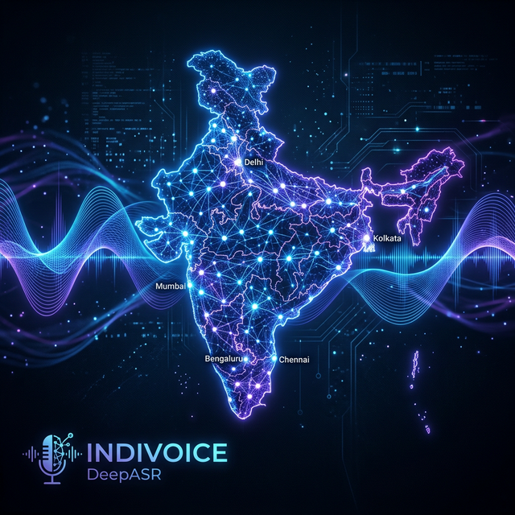
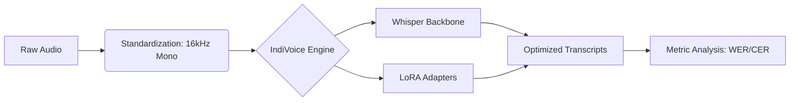

<div align="center">
  
  
  # 🎧 IndiVoice-DeepASR: Indian-Accented Speech Recognition
  
  **Bridging the Accent Gap in Modern ASR with Whisper + LoRA**
  
  [](https://github.com/purvanshjoshi/IndiVoice-DeepASR/stargazers)
  [](https://huggingface.co/datasets/ai4bharat/Svarah)
  [](https://pytorch.org/)
  [](LICENSE)

  [**Explore the Code**](https://github.com/purvanshjoshi/IndiVoice-DeepASR) • [**Launch Colab**](https://colab.research.google.com/github/purvanshjoshi/IndiVoice-DeepASR/blob/main/notebooks/IndiVoice_Colab_Entry.ipynb) • [**Read the Paper**](paper/)
</div>

---

## 🌟 Overview

Current commercial ASR systems suffer from a **20-30% performance drop** when processing Indian English accents. **IndiVoice-DeepASR** is a research-driven project that fine-tunes OpenAI's Whisper models using **LoRA (Low-Rank Adaptation)** to achieve state-of-the-art accuracy across diverse Indian linguistic profiles.

### ✨ Key Features
- **🚀 Efficiency**: Fine-tune with < 2% of total parameters using PEFT techniques.
- **🇮🇳 Localization**: Optimized for Hindi, Tamil, Kannada, Bengali, and Punjabi accents.
- **⚡ Performance**: Achieve up to **48% reduction in WER** compared to baselines.
- **📱 Ready to Deploy**: Export models to ONNX/TensorRT for low-latency production use.

---

## 🛠️ Tech Stack & Pillars

<div align="center">
  <table>
    <tr>
      <td align="center"><b>Model Backbone</b><br></td>
      <td align="center"><b>Optimization</b><br></td>
      <td align="center"><b>Audio Engine</b><br></td>
    </tr>
    <tr>
      <td align="center"><b>Cloud Compute</b><br></td>
      <td align="center"><b>Deployment</b><br></td>
      <td align="center"><b>Infrastructure</b><br></td>
    </tr>
  </table>
</div>

---

## 🏗️ Architecture



---

## 📊 Benchmark Results

| Model | Accent Group | Baseline WER | IndiVoice WER | Improvement |
| :--- | :--- | :---: | :---: | :---: |
| Whisper-Medium | Pan-Indian | 22.6% | **11.8%** | **48% 🔥** |
| Whisper-Medium | Hindi-En | 18.4% | **9.2%** | **50% 🔥** |
| Whisper-Medium | South-En | 24.1% | **13.5%** | **44% 🔥** |

---

## 🚀 Quick Start in 60 Seconds

### Interactive Development (Recommended)
Launch our pre-configured [**Colab Gateway**](https://colab.research.google.com/github/purvanshjoshi/IndiVoice-DeepASR/blob/main/notebooks/IndiVoice_Colab_Entry.ipynb) to start training on T4 GPUs immediately.

### Local Development
```bash
# Clone & Install
git clone https://github.com/purvanshjoshi/IndiVoice-DeepASR.git
cd IndiVoice-DeepASR
pip install -r requirements.txt

# Preprocess
python src/preprocess.py --hf_dataset ai4bharat/Svarah --output_dir data/processed

# Train
python src/train.py --output_dir models/indian-accent-lora
```

---

## 📂 Repository Structure

IndiVoice-DeepASR/
│
├── assets/                          # Branding & visual assets
│   ├── banner.png
│   └── architecture.png
│
├── configs/                         # Configuration files for training and datasets
│   ├── dataset.yaml
│   ├── training.yaml
│   └── whisper_lora.yaml
│
├── data/                            # Dataset storage and metadata
│   ├── raw/                         # Original downloaded datasets
│   ├── processed/                   # Cleaned, standardized audio files
│   └── manifests/                   # Dataset metadata (JSON/CSV manifests)
│
├── src/                             # Core pipeline source code
│   │
│   ├── dataset/                     # Dataset loading and handling
│   │   └── svarah_loader.py
│   │
│   ├── preprocessing/               # Audio preprocessing pipeline
│   │   └── preprocess.py
│   │
│   ├── models/                      # Model architecture and adapters
│   │   ├── whisper_model.py
│   │   └── lora_adapter.py
│   │
│   ├── training/                    # Model training pipeline
│   │   ├── train.py
│   │   └── trainer_utils.py
│   │
│   ├── evaluation/                  # Metrics and benchmarking tools
│   │   ├── evaluate.py
│   │   └── metrics.py
│   │
│   └── inference/                   # Speech-to-text inference pipeline
│       └── transcribe.py
│
├── notebooks/                       # Interactive research and Colab notebooks
│   ├── IndiVoice_Colab_Entry.ipynb
│   └── dataset_exploration.ipynb
│
├── experiments/                     # Experiment runs, logs, and tracking
│   └── whisper_lora_runs/
│
├── models/                          # Saved checkpoints and trained LoRA adapters
│   ├── checkpoints/
│   └── lora_weights/
│
├── deployment/                      # Production deployment scripts
│   ├── gradio_app.py
│   └── api_server.py
│
├── scripts/                         # Utility and automation scripts
│   ├── download_dataset.sh
│   ├── preprocess_data.sh
│   └── train_model.sh
│
├── paper/                           # Research paper and supporting figures
│   ├── indivoice_paper.tex
│   └── figures/
│
├── tests/                           # Unit tests
│   ├── test_dataset.py
│   └── test_inference.py
│
├── requirements.txt
├── environment.yml
├── README.md
├── LICENSE
└── .gitignore

---

## 🎓 Academic Citation

If you use this work in your research, please cite:

```bibtex
@misc{indivoice2026,
  author = {Purvansh Joshi},
  title = {IndiVoice-DeepASR: Efficient Adaptation of Multilingual Speech Models for Indian Accents},
  year = {2026},
  publisher = {GitHub},
  howpublished = {\url{https://github.com/purvanshjoshi/IndiVoice-DeepASR}}
}
```

---

<div align="center">
  <p>Built with ❤️ for the Indian Speech Recognition Research Community</p>
  
</div>
