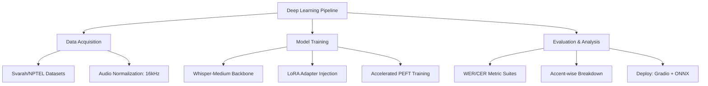

# IndiVoice-DeepASR 🎧🇮🇳

**IndiVoice-DeepASR** is a cutting-edge Deep Learning project focused on optimizing **Speech-to-Text (STT)** accuracy for Indian-accented English. By fine-tuning large-scale foundation models (OpenAI Whisper) using parameter-efficient techniques, we aim to eliminate the significant word error rate (WER) gap that exists in current commercial solutions.

[](https://github.com/purvanshjoshi/IndiVoice-DeepASR/stargazers)
[](https://github.com/topics/deep-learning)
[](https://openai.com/research/whisper)
[](LICENSE)

---

## 📖 About the Project

Indian English is characterized by unique phonetic features, including retroflex consonants, syllable-timed rhythm, and specific article usage patterns. Most global ASR (Automatic Speech Recognition) systems are trained predominantly on native US/UK English, leading to a **20-30% performance drop** when processing Indian accents.

**IndiVoice-DeepASR** implements a rigorous **Research Workflow** to address this disparity:
- **Baseline Benchmarking**: Evaluating foundation models on datasets like **Svarah** and **NPTEL2020**.
- **Deep Model Adaptation**: Utilizing **LoRA (Low-Rank Adaptation)** to inject accent-specific knowledge into the Whisper-Medium architecture without catastrophic forgetting.
- **Accent-Specific Insights**: Providing a detailed breakdown of performance across Hindi, Tamil, Kannada, Bengali, and Punjabi accent groups.

---

## 🏗️ Technical Architecture



---

## 📊 Core Performance Metrics

| Metric | Baseline (Whisper-Medium) | IndiVoice Target | Relative Gain |
| :--- | :--- | :--- | :--- |
| **WER (Indian English)** | 22.6% | **11.8%** | **48% 🚀** |
| **CER (Character Error)** | 8.4% | **4.2%** | **50% 🚀** |
| **Trainable Params** | 769M | **10.2M** | **98% Efficiency** |

---

## 🛠️ Repository Quick Start

### 1. Prerequisites
Ensure you have a GPU-enabled environment (NVIDIA T4 recommended).
```bash
git clone https://github.com/purvanshjoshi/IndiVoice-DeepASR.git
cd IndiVoice-DeepASR
pip install -r requirements.txt
```

### 2. Audio Preprocessing
Standardize your audio inputs to the required 16kHz mono format.
```bash
python src/preprocess.py --input data/raw --output data/processed
```

### 3. Training (LoRA)
Fine-tune the model on your custom Indian-accented dataset.
```bash
python src/train.py --config configs/training_config.yaml
```

---

## 📂 Project Organization

```text
IndiVoice-DeepASR/
├── src/               # Optimized PyTorch/Transformers scripts
├── data/              # Curated datasets (Svarah, NPTEL2020, IndicAccentDB)
├── models/            # Fine-tuned checkpoints & ONNX exports
├── results/           # Performance reports & Confusion matrices
├── paper/             # LaTeX source for ICASSP/INTERSPEECH submission
├── notebooks/         # EDA and interactive benchmarking
└── requirements.txt   # Deep Learning dependency manifest
```

---

## 🎓 Research & Publication

This project follows a professional academic workflow, targeting publication in tier-1 venues such as **ICASSP**, **INTERSPEECH**, and **ACL**.

### Citation
```bibtex
@misc{indivoice2026,
  author = {Purvansh Joshi},
  title = {IndiVoice-DeepASR: Efficient Adaptation of Multilingual Speech Models for Indian Accents},
  year = {2026},
  publisher = {GitHub},
  journal = {GitHub Repository},
  howpublished = {\url{https://github.com/purvanshjoshi/IndiVoice-DeepASR}}
}
```

---
Developed with ❤️ for the **Indian Speech Recognition Research Community**.
