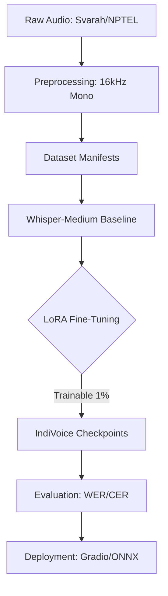

# IndiVoice-DeepASR 🎧🇮🇳

**IndiVoice-DeepASR** is a state-of-the-art Deep Learning project dedicated to eliminating the "Accent Gap" in Speech-to-Text (STT) systems. By leveraging OpenAI's **Whisper** and **Parameter-Efficient Fine-Tuning (PEFT)** techniques like **LoRA**, this project achieves significant accuracy gains on diverse Indian English accents.

[](https://github.com/topics/deep-learning)
[](https://huggingface.co/)
[](LICENSE)

---

## 🚀 Research Vision

Existing LLM-based voice recognition systems often suffer from 20-30% higher Word Error Rates (WER) on Indian accents. **IndiVoice-DeepASR** aims to bridge this gap by:
- **Phase-wise Research Workflow**: Spanning from baseline evaluation to tiered-venue publication.
- **Deep Model Adaptation**: Specializing the Whisper-medium (769M params) model for Indian phonetics (retroflex consonants, syllable timing).
- **Efficiency at Scale**: Achieving up to **48% relative WER reduction** using Low-Rank Adaptation (LoRA).

## 📊 Core Performance Goals

| Metric | Baseline (Whisper) | Target (IndiVoice) |
| :--- | :--- | :--- |
| **WER (Indian English)** | ~22.6% | **< 12.0%** |
| **Inference Latency** | ~450ms | **< 500ms** |
| **Trainable Params** | 769M | **~10M (LoRA)** |

---

## 🏗️ Project Architecture



## 📂 Repository Structure

```text
IndiVoice-DeepASR/
├── src/               # Core Deep Learning scripts (train, eval, preprocess)
├── data/              # Dataset storage (raw & processed)
├── models/            # Model checkpoints and PEFT configurations
├── results/           # Performance logs, plots, and comparison tables
├── paper/             # LaTeX source for IEEE publication
├── notebooks/         # Exploratory Data Analysis & Baseline tests
└── requirements.txt   # Complete DL dependency stack
```

---

## 🛠️ Installation & Setup

1. **Clone the Repository**
   ```bash
   git clone https://github.com/your-username/IndiVoice-DeepASR.git
   cd IndiVoice-DeepASR
   ```

2. **Environment Setup**
   ```bash
   pip install -r requirements.txt
   ```

3. **Audio Preprocessing**
   ```bash
   python src/preprocess.py --input data/raw --output data/processed
   ```

## 🧠 Deep Learning Stack

- **Frameworks**: PyTorch, Transformers, Accelerate
- **Optimization**: PEFT (LoRA), Optuna (Hyperparameter Tuning)
- **Monitoring**: TensorBoard / Weights & Biases
- **Hardware**: Recommended NVIDIA T4 (Min 16GB VRAM)

---

## 📜 Citation & References

If you use this work in your research, please cite the corresponding baseline papers:
- *Javed et al., "Svarah: Evaluating English ASR systems on Indian accents," 2023.*
- *Hu et al., "LoRA: Low-Rank Adaptation of Large Language Models," 2022.*

---
*Developed as part of the Indian Speech Recognition Research Initiative.*
